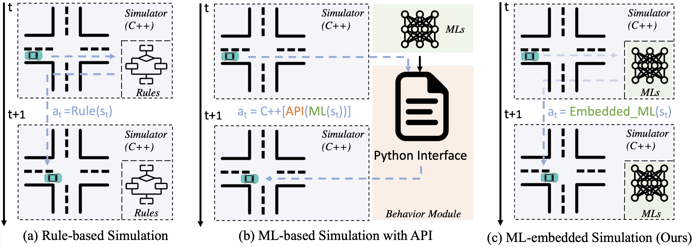
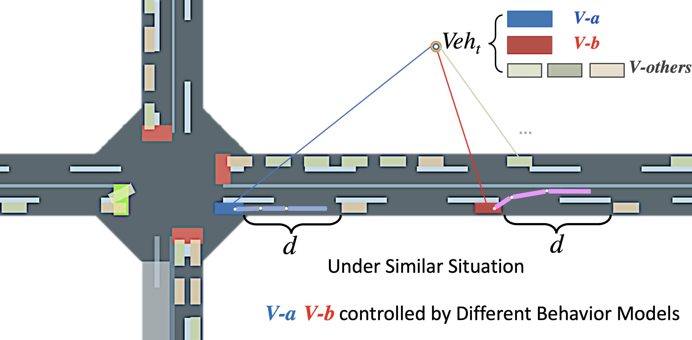
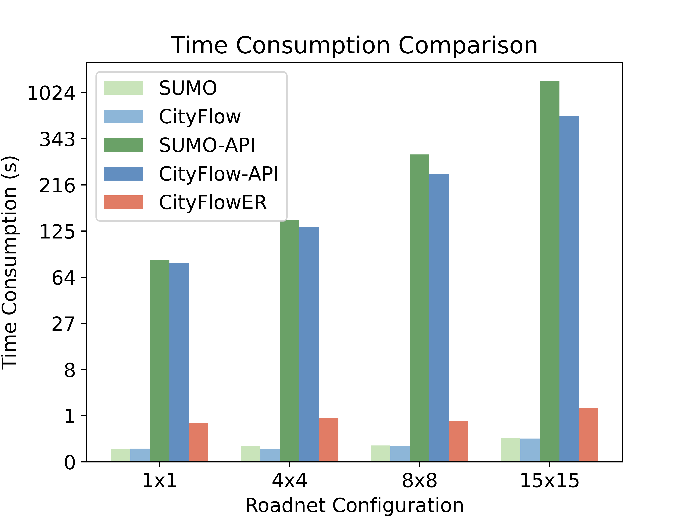
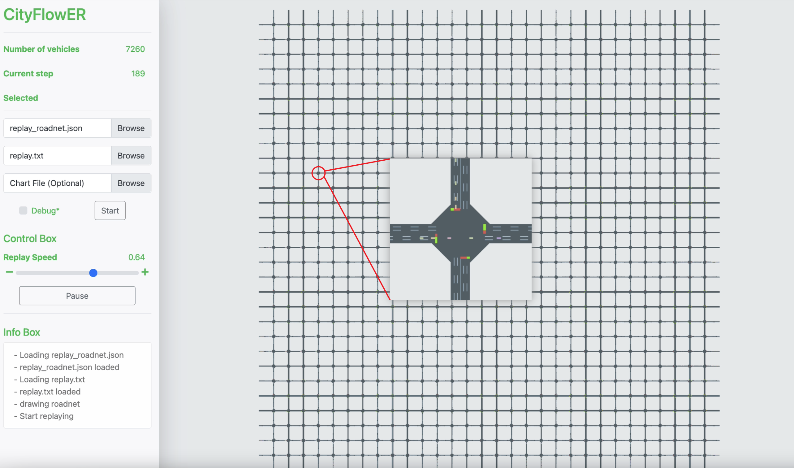

# CityFlowER: Efficient and Realistic Traffic Simulation

[](https://cityflow.readthedocs.io/en/latest/?badge=latest)

[](https://dev.azure.com/CityFlow/CityFlow/_build/latest?definitionId=2&branchName=master)

CityFlowER is An Efficient and Realistic Traffic Simulator Platform with Embedded Machine Learning Models. It Can Support Multi-agent Reinforcement Learning for Various Traffic Analysis and Control Tasks.

Framework and comparison to other implementations:
<div style="text-align: center;">

</div>

This simulator introduces following features:


- **Realistic** A microscopic traffic simulator which simulates the behavior of each vehicle. **Any individual vehicle can be controlled by one or multiple behavior models** to mimic the realistic driving scenario.
<div style="text-align: center;">

</div>

- **Efficient** The embedded structure's simulation speed is much faster than API based implementation, and approximating the rule based control methods.
<div style="text-align: center;">
    
</div>


- **Large Scale** CityFlowER support large scale simulation efficiently.
<div style="text-align: center;">
    
</div>


- Simple config setting for loaded models. You could find the following implementation in `src/vehicle/vehicle.cpp` or `src/vehicle/lanechange.cpp` The code blocks to import rule based file is shown below: We also provide training example in `Imitate_cityflow/*`, please check it out for example of training:


    ```cpp
    // vehicleInfo is updated out of the function
    // "PATH" is the pre-trained model path
    double Vehicle::getCarFollowSpeed(double interval) {

    Vehicle *leader = getLeader();
    std::vector<torch::jit::IValue> input_feature;
    auto input = torch::tensor ({leader->getSpeed(), vehicleInfo.speed ...});

    input_feature.push_back(input);
    static torch::jit::script::Module speedModel = torch::jit::load("PATH");

    at::Tensor output_speed = speedModel.forward(input_feature).toTensor();
    return output_speed.item<double>();
    }
    ```

    ```cpp
    void SimpleLaneChange::makeSignal(double interval) {

    std::vector<torch::jit::IValue> input_feature;
    auto input = torch::tensor ({vehicle->engine->getCurrentTime(),...});
    input_feature.push_back(input);

    static torch::jit::script::Module laneModel = torch::jit::load("PATH");
    at::Tensor lane_choice = laneModel.forward(input_feature).toTensor();
    signalSend->target = lane_choice;
    }
    ```
    For large scale vehicle settings, you could also define `control_config.xml` and mapping the `vehicle_id` with assigned `ML models` intended to use.

    In next updated version, we will provide this detailed instructions for the defination of `control_config.xml`.

## Featured Research and Projects Using CityFlow

- [PressLight: Learning Max Pressure Control to Coordinate Traffic Signals in Arterial Network (KDD 2019)](http://personal.psu.edu/hzw77/publications/presslight-kdd19.pdf)
- [CoLight: Learning Network-level Cooperation for Traffic Signal Control](https://arxiv.org/abs/1905.05717)
- [Traffic Signal Control Benchmark](https://traffic-signal-control.github.io/)
- [TSCC2050: A Traffic Signal Control Game by Tianrang Intelligence (in Chinese)](http://game.tscc2050.com/) [Tianrang Intelligence home page](https://www.tianrang.com/)

## Links
- [Home Page](https://github.com/cityflow-project/CityFlowER.git)
- [Simulation Demo Video](https://youtu.be/GD3IWPtW2PA)


